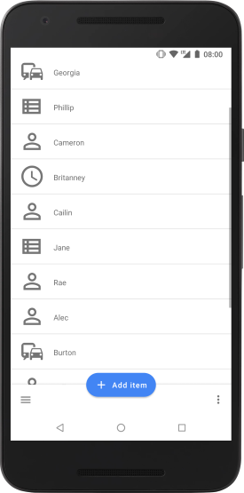
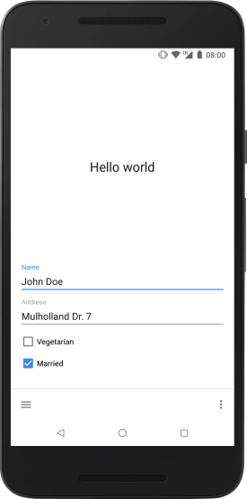
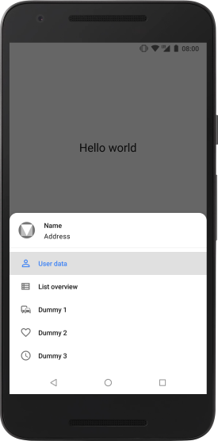

# Material2
A very simple app for testing elements of Material Design 2.0 and the new Architecture Components from Android Jetpack that facilitate the MVVM pattern.

Noteworthy elements are:
* ViewModel
* LiveData
* Data Binding
* Material Components

## Screenshots

## Libraries
The app uses the following libraries, whose licenses can be found in [LICENSE-3RD-PARTY](LICENSE-3RD-PARTY).
* [AndroidX](https://android.googlesource.com/platform/frameworks/support/+/androidx-master-dev)
* [Material Components for Android](https://github.com/material-components/material-components-android)

## Credits
The following resources have been tremendously helpful.
* [Android Bottom Navigation Bar with drop shadow](https://stackoverflow.com/a/41651284)
* [Implementing Google's refreshed modal bottom sheet](https://medium.com/halcyon-mobile/implementing-googles-refreshed-modal-bottom-sheet-4e76cb5de65b)
* [Architecture Components pitfalls—Part 1](https://medium.com/@BladeCoder/architecture-components-pitfalls-part-1-9300dd969808)
* [Samples for Android Architecture Components](https://github.com/googlesamples/android-architecture-components)
* [Android Sunflower sample](https://github.com/googlesamples/android-sunflower)

## License
[MIT License](LICENSE)
